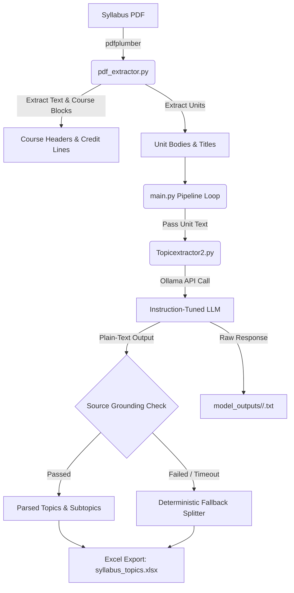

# 📚 Syllabus Topic Extractor

An automated NLP & LLM pipeline designed to extract, structure, and categorize academic syllabus topics and subtopics from university curriculum PDFs into structured Excel sheets while retaining audit logs of raw model responses.

---

## 🌟 Overview

The **Syllabus Topic Extractor** addresses the challenge of converting heterogeneous, unstructured university syllabus PDF documents into high-quality, tabular datasets (`.xlsx`). 

By combining **deterministic rule-based PDF parsing** (`pdf_extractor.py`) with **instruction-tuned Large Language Models via Ollama** (`Topicextractor2.py`), the system extracts course information, unit boundaries, topics, and subtopics with high fidelity and built-in source grounding validation.

---

## 📁 Repository Structure & Core Modules

This repository focuses on the following core components:

```
.
├── main.py               # Orchestration pipeline and Excel export
├── pdf_extractor.py      # PDF text extraction & structural course/unit parsing
├── Topicextractor2.py    # LLM extraction engine, prompt rules & grounding validator
├── requirements.txt      # Project dependencies
└── model_outputs/        # Raw LLM response logs organized by model & subject code
```

---

## 🏗 System Architecture & Workflow



---

## 🔍 Module Details

### 1. `pdf_extractor.py` — PDF & Structural Parser
Responsible for converting raw PDF pages into clean course and unit structures without reliance on an LLM.

- **Text Normalization**: Strips soft hyphens (`\u00ad`), non-breaking spaces (`\xa0`), and normalizes line breaks (`normalize_text`).
- **Course Header Detection**: Uses regex patterns to identify subject codes (e.g., `CS3301`) and credit distribution lines (`L T P E C` format, e.g., `3 0 0 0 3`).
- **Unit Boundary Parsing**: Matches unit headers (e.g., `UNIT I`, `UNIT 2`), extracts unit titles, and isolates unit bodies while discarding extraneous sections such as *Course Outcomes*, *Total Periods*, and *References*.

---

### 2. `Topicextractor2.py` — LLM Extraction Engine
Performs intelligent extraction of main topics and child subtopics using local LLMs hosted via **Ollama** (e.g., `gemma3:12b`, `gemma3:4b`, `mistral`, `phi3:mini`).

- **Few-Shot System Prompt**: Guides the LLM to analyze syllabus text and recognize structural patterns:
  - **Explicit Category Headings**: `Category: item A, item B` $\rightarrow$ Topic & Subtopics.
  - **Flat Topics**: Independent topics without sub-hierarchy.
  - **Dash / Comma Rules**: Prevents false parent-child assumptions based solely on dashes or commas.
  - **Exact Text Preservation**: Enforces zero paraphrasing, summarizing, or spelling modifications.
- **Output Format**: Returns strict plain-text key-value lines:
  ```text
  Topic: Language development
  Subtopic: Subject-Verb Agreement
  Subtopic: Tenses
  ```
- **Source Grounding Validation (`validate_against_source`)**: Verifies that every extracted topic/subtopic actually exists within the original source unit body using sliding N-gram window checks. Hallucinated responses are rejected.
- **Fallback Mechanism (`split_topics_fallback`)**: If the LLM fails or returns ungrounded output, the pipeline gracefully falls back to deterministic delimiter-based topic extraction (`–`, `-`, `.`).

---

### 3. `main.py` — Pipeline Orchestration & Output
Connects the PDF extractor and topic extractor into an automated batch processing workflow.

- **Configuration**:
  - `PDF_PATH`: Target syllabus PDF file.
  - `START_PAGE` / `END_PAGE`: Page range selection.
  - `MODEL_NAME`: Ollama model selector (e.g., `gemma3:12b`).
  - `OUTPUT_EXCEL`: Resulting Excel file destination (`syllabus_topics.xlsx`).
- **Raw Log Storage (`save_raw_output`)**: Appends original unit input text and exact raw LLM responses to dedicated text files inside `model_outputs/<SAFE_MODEL_NAME>/<subject_code>.txt`.
- **Excel Formatting**: Generates unique record identifiers (e.g., `CS33_M1_T1`) and saves structured fields to Excel (`pandas` / `openpyxl`).

---

### 4. `model_outputs/` — Model Evaluation & Audit Directory
Stores unprocessed inputs and raw LLM outputs organized by model directory:

```text
model_outputs/
├── gemma3_12b/
│   ├── CS3301.txt
│   ├── CS3351.txt
│   └── ...
├── gemma3_4b/
├── mistral/
└── phi3_mini/
```

Each log file records:
- Subject Code & Name
- Unit Number
- Model Identifier
- Original Input Body
- Raw Model Output (unfiltered)

---

### 5. `requirements.txt` — Dependencies

```text
pdfplumber>=0.10.0   # Text and page extraction from PDF files
pandas>=2.0.0       # Data structuring and Excel generation
openpyxl>=3.1.0     # Excel spreadsheet engine for pandas
requests>=2.28.0    # HTTP requests to local Ollama API server
```

---

## 🚀 Getting Started

### Prerequisites
1. **Python**: Python 3.9 or higher.
2. **Ollama**: Download and install [Ollama](https://ollama.ai/).
3. Pull your target model:
   ```bash
   ollama pull gemma3:12b
   ```

---

### Installation

1. Clone the repository:
   ```bash
   git clone https://github.com/Din3sh-K/Intern-syllabus-mapper.git
   cd Intern-syllabus-mapper
   ```

2. Install Python dependencies:
   ```bash
   pip install -r requirements.txt
   ```

---

### Running the Pipeline

1. Ensure your local Ollama instance is active:
   ```bash
   ollama serve
   ```

2. Configure `main.py` parameters if necessary:
   ```python
   PDF_PATH = "SSN_BE_CSE.pdf"
   MODEL_NAME = "gemma3:12b"
   ```

3. Execute the pipeline:
   ```bash
   python main.py
   ```

---

## 📊 Data Schema (`syllabus_topics.xlsx`)

| Column Header | Example Value | Description |
| :--- | :--- | :--- |
| `id` | `CS33_M1_T1` | Unique ID combining subject prefix, module number, and topic index |
| `subject_code` | `CS3301` | Course code extracted from syllabus header |
| `subject_name` | `DATABASE MANAGEMENT SYSTEMS` | Title of the subject |
| `module_no` | `I` | Unit / Module number |
| `module_title` | `RELATIONAL DATABASES` | Title of the specific unit |
| `topic` | `Relational Model` | Extracted main topic |
| `sub_topic` | `Relational Algebra` | Extracted subtopic (or empty string if flat topic) |

---

## 🛡 Performance & Fallback Summary

Upon completion of `main.py`, a summary report is displayed in the terminal:

```text
============================================================
Courses detected in PDF: 45
Subjects tested: 4
Topic Records: 128
Units parsed by LLM: 18
Units using fallback: 2
============================================================
Output saved to: syllabus_topics.xlsx
Raw model outputs saved to: model_outputs/
```

---
